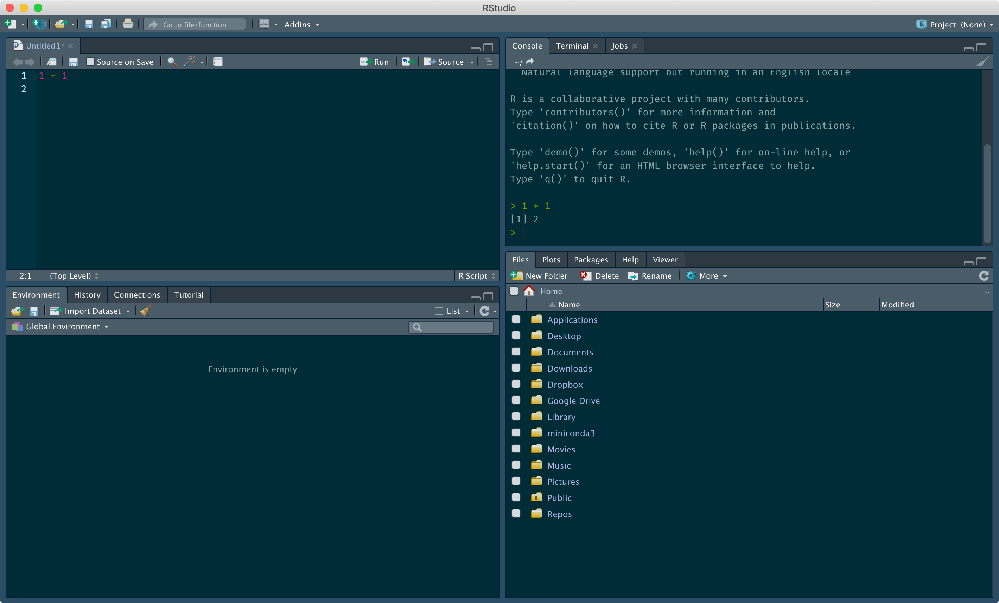
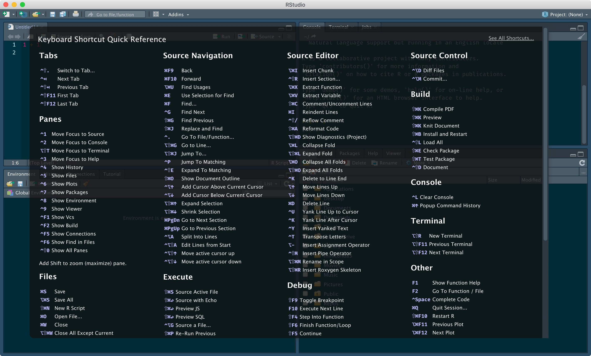

## Tutorial

### Learning Objectives

- Set up the R programming language and the RStudio IDE
- Navigate the RStudio interface
  - Customize RStudio options for reproducibility and convenience
  - Describe the purpose of the main panes in RStudio (Source, Console, Environment, History, Files, Plots, Packages, Help)
  - Locate important buttons in RStudio (Projects, Open/Save, Run/Source)
  - Differentiate between writing R code in the console versus scripts
  - Discover, edit, and create keyboard shortcuts in RStudio
- Write simple R statements
  - Perform simple arithmetic calculations
  - List arithmetic operators (+, -, \*, /, ^, ()) and their precedence
  - Compare values with logical operators (`==`/`!=`, `<`/`<=`, `>`/`>=`)
  - Describe the structure and behaviour of a function call
  - Define a variable with a valid name and retrieve its contents
- Identify where to look when seeking for help
  - Locate the help page for functions and special operators
  - Resolve an error message using a web search tool
  - Formulate effective questions for their peers

### Context

There are a lot of moving parts in data science, but what better place to start than with the tools. While basic data science can be accomplished using programs with graphical user interfaces like Excel, programming languages are readily scalable and can open up a world of possibilities. They also tend to bring together a community of like-minded individuals. In this series of tutorials, we choose R over other languages such as Python and Julia because it was designed with data at its heart and is surrounded by a thriving, inclusive, and helpful community. 

Another reason we choose R is its tight integration with the RStudio integrated development environment (IDE). IDEs serve to streamline programming, which has many moving parts. One key benefit of RStudio compared to other IDEs is that it shares the same free and open-source philosophy as the R programming language. We believe in the democratization of data science. Over the coming tutorials, you will come to appreciate the many features offered by RStudio. For today, we will focus on its integrated text editor and R console. 

In this tutorial, you will become familiar with the RStudio interface and start writing your first R code. If this is your first time programming, then you're in for a rewarding journey! You will be introduced to fundamental programming concepts like operators and variables. You will also see functions in actions and why they're so useful in programming. Finally, you will already start practising how to seek for help using online resources. This skill is critical for any data scientist.

### The RStudio Interface

If you are using a personal computer, you will first need to [install R](https://cran.r-project.org/) and [RStudio](https://www.rstudio.com/). Alternatively, you can use [RStudio Cloud](https://rstudio.cloud/) to avoid the hassle of installing software on a local computer. 

Once R and RStudio are installed, you should be able to open RStudio and see the following interface. The following screenshots were taken on macOS. The frame will look slightly different if you're using a different operating system (_e.g._ Windows) or RStudio Cloud, but the general layout should be identical. By default, you are greeted by the following three panes. The tabs in bold are the ones you will be using in these tutorials the most. 

- The **Console**/Terminal/Jobs pane (left)
- The **Environment**/History/Connections/Tutorial pane (top-right)
- The **Files**/**Plots**/**Packages**/**Help**/Viewer pane (bottom-right)


The fourth and final Source pane appears when files are opened (top-left). Here, a new Untitled R script was created via the top menu under File > New File > R script. (On macOS, the top menu is at the top of the screen outside of the RStudio window.) The Console pane moves to the bottom-left when the Source pane is open.


Before doing anything else, you should update two RStudio settings. These changes will help ensure that you don't run into any unexpected behaviour. You can access the RStudio settings via the top menu under Tools > Global Options. You will want to disable the following two options, which should appear in the General (Basic tab) section under Workspace:

- Uncheck "Restore .RData into workspace at startup"
- Set "Save workspace to .RData on exit" to Never

The end result should look like this:


There is a wide range of additional options that you can configure in RStudio based on your personal preference. For example, under the Appearance section, you can change the zoom level (how big visual elements like icons appear in RStudio), the font and font size, and the colour scheme. 


You can also change the pane locations under the Pane Layout section. Many RStudio users prefer having their Console pane at the top-right next to the Source pane because these two panes tend to be the most important and thus the largest. Again, there is no "correct" approach. Tweak based on what you prefer.


Take some time to explore the available settings in the Global Options. What else did you tweak?

Obviously, another important aspect of RStudio is running R code. There are two general approaches to running code in RStudio:

1. Run code directly in the Console pane
    - This option is convenient for small tasks, but it doesn't scale to larger analyses.
    - Relying on the R History for keeping track of past commands is tedious and error-prone.
2. Write code in the Source pane and selectively run code in the Console
    - This is the recommended approach to running R code in RStudio.
    - By storing code in files, you can easily re-run previously used code.
    - Button and keyboard shortcuts in RStudio make it easy to run bits of code in the console.

When you want to selectively run R code in the Console, you can click the "Run" button at the top-right of the Source pane. If you have code selected, this will run the selected code. Otherwise, it will run the line of code where your flashing text cursor is located. If you hover over the "Run" button for a few seconds, you should see an associated keyboard shortcut. By default, it should be Cmd-Enter on macOS or Ctrl-Enter on Windows. Commit this to memory, because you will use this shortcut a lot in this course. 



You can open a keyboard shortcut summary via the top menu under Tools > Keyboard Shortcuts Help. You can also edit keyboard shortcuts under Tools > Modify Keyboard Shortcuts. These shortcuts can minimize the time you spend using your mouse/trackpad, which in turn increases your productivity. It's worthwhile looking up or setting keyboard shortcuts for anything you do repeatedly.



### Mathematical Operators

Now that you have a handle on the RStudio interface, you can get your hands dirty with some R code! You can start writing any code posted below in a new R script and run each line using the Run button (or keyboard shortcut).

Let's start with a simple calculation and break it down. Here, you are adding two numbers, 1 and 100, together using the `+` operator. When this bit of R code is run in the Console, you get the total, which is 101. For now, you can ignore the `[1]` appearing before the total. It will make more sense after the next tutorial.

```{r}
1 + 100
```

As expected, you have access to the usual set of arithmetic operations in R. They follow the same precedence as in mathematics, namely:

- Parentheses: `(` and `)`
- Exponents: `^`
- Multiply: `*`
- Divide: `/`
- Add: `+`
- Subtract: `-`

To demonstrate operator precedence, run the following line of R code, also known as a statement. The result you will get (`13`) is consistent with the multiplication being calculated before the addition. 

```{r}
3 + 5 * 2
```

Just like in arithmetic, you can override the order of operations with parentheses, as follows. The following statement outputs `16`, which is the correct output if the addition is performed before the multiplication.

```{r}
(3 + 5) * 2
```

You can also choose to add parentheses to improve readability, even if they don't change the precedence of the operations. There is a careful balance to strike with parentheses. As you can see in the first example below, too many parentheses can hinder readability. Ultimately, this is a stylistic choice that is up to personal preference.

```{r}
(3 + (5 * (2 ^ 2)))  # hard to read
3 + 5 * 2 ^ 2        # clear, if you remember the rules
3 + 5 * (2 ^ 2)      # if you forget some rules, this might help
```

In the above code, you can notice the text prefixed with the pound/hash sign (`#`). These are called code comments (not hashtags). They are completely ignored by the computer when running code. These are useful for adding useful notes for humans to better understand nearby code. Again, these comments are completely ignored by the machine; they are meant for human eyes. Comments can either be appended to the right of a line (shown above) or be on their own line (shown below). 

```{r}
12 / 3
# 20 / 10
```

Sooner or later, you will eventually hear the verb "comment out", usually in the context of "turning off" some chunk of code. This refers to the act of prefixing the lines of code in question with the comment character (`#` in R). It's useful to comment out old lines of code that are no longer relevant, but you want to keep them for future reference. 

If you generate an output consisting of a very small or large number, you might run into the scientific notation. For example, the fraction two millionths is displayed as `2e-06`, which can be interpreted as $2 \times 10^{-6}$. It's important to note that the `e` here has nothing to do with the Euler's number, $e$.

```{r}
2 / 1000000
```

In addition to seeing the notation in the output, you can use it yourself to express very small or large numbers. The output may or may not be in scientific notation, depending on how small/large the number is and how your R is configured. For more information, you can look up the `scipen` (_i.e._ penalty for scientific notation) under the R options using `?options`.

```{r}
4e-5    # A small positive number
-2.3e7  # A large negative number
1e2     # 100 expressed in scientific notation (but usually not output as such)
```

Now that you're running R code, your Console will look something like this sooner or later. The `>` character indicates where you can run code and is known as the prompt. The prompt becomes a plus sign (`+`) when it wants to indicate that it's expecting additional input. Here, R is expecting more code because you haven't provided the second value for the multiplication. Note that the `+` prompt (_i.e._ as the first character of the line) has nothing to do with the addition (`+`) operator. 

```
> 2 *
+ 
```

To get rid of the issue, you can complete the operation. In this case, if you provide a second value in the Console and press Enter, you obtain the expected output. Again, the `+` only indicates that the two lines are connected. The operation that was actually performed was `2 * 4`. 

Note that the output (_i.e._ `[1] 8`) isn't preceded by the prompt character (`>` or `+`). This is the normal behaviour. Specifically, the prompt (`>` or `+`) is meant to precede lines of code, whereas the output of any code is produced as is.

```
> 2 *
+ 4
[1] 8
```

Alternatively, you can press the Escape key to cancel the current operation. In this case, the operation will not produce any output, and the usual `>` prompt will return. Once you revert to this normal state. you can perform the full calculation. 

```
> 2 *
+ 

> 2 * 4
[1] 8
```

### Mathematical Functions

So far, you have been using operators like `+` and `*` for performing mathematical calculations. They take in some inputs (_e.g._ two numbers) and follow some expected behaviour (_e.g._ addition) to produce some output (_e.g._ the sum). This pattern underpins the next important programming concept covered here: functions. 

Functions generally have inputs, follow some documented behaviour, and produce some output, just like the operators above. The function inputs are known as arguments or parameters. They determine the behaviour of the function. In most cases, the function will produce the same output if given the same input. One notable exception to this rule is the group of functions that are random in nature (_e.g._ random sampling). 

Let's work through an example: calculating the natural logarithm. In the example shown below, you are running the function called `log` with the value of `1`. This is called a function call (_i.e._ when you use/call a function). There are three components:

1. The function name (here, `log`)
2. The parentheses to indicate you are using/calling the function
3. The input to the function within parentheses, which varies based on the function (here, `1`)

```{r}
log(10)
```

If you attempt to run a function without parentheses, you will instead obtain the function definition, _i.e._ the code that tells R what to do when the function is called, usually processing the input in some way. You almost never want to do this. 

```{r}
log
```

Also, without parentheses, you cannot provide any input. So, don't forget to add parentheses every time you use a function, even if you don't have to provide an input. 

There are countless functions available in R, but you don't have to worry about remembering them all. It's more practical to rely on Google whenever you need to look up a function. Over time, you will come to know the most useful functions. Here are some commented examples:

```{r}
cos(1)    # trigonometry
exp(0.5)  # e^(1/2)
sqrt(9)   # square root of 9
```

It's worth noting that functions aren't restricted to one input value. For example, the following function returns one random value (first argument) from a normal distribution centred at a mean of 10 (second argument). As you can see, the arguments are separated by commas. 

```{r}
rnorm(1, 10)
```

It's important to realize that the order matters. For example, if you swap the two arguments, you get 10 random values from a normal distribution centred at a mean of 1. Notice that you don't get an error. When code technically works but doesn't do what you want it to do is called a logical error. These are the most pernicious of errors because they can pass undetected. Fortunately, it's easy here to see that we're getting nine more numbers than expected.

```{r}
rnorm(10, 1)
```

You can avoid this pitfall by explicitly naming our arguments. This way, R doesn't assume the order of the arguments. You can list the arguments in whatever order you prefer.

```{r}
rnorm(mean = 10, n = 1)
rnorm(n = 1, mean = 10)
```

Other examples of functions that take in more than one argument are the arithmetic operators you've been using. In fact, they're functions in disguise. You want proof? If you wrap the operator with backticks (`` ` ``), you can use them as if they were a function name (see below). On Canadian/American English keyboards, you can find the backtick to the left of the `1` key. Needless to say, this inconvenient notation is never used in practice.

```{r}
`+`(4, 7)
`*`(2, 3)
```

Now, you might be wondering how you could possibly remember all of these function arguments and their order (or their names). A really useful feature of R is that you can open the help page (also called a manual) for any function by running `?` followed by the function name. In this case, you don't include the parentheses because you don't want to run the function. If you do this in RStudio, it will open the function help page in the Help pane, where the Files are usually located.

These help pages can be esoteric and hard to read. Don't panic. You will get used to them over time. There are a few common sections: Title, Description, Usage, Arguments, Details, Value, and Examples. Generally, these manuals are useful to learn about function arguments and to see working examples in action. If the function help page isn't enough, you can always use Google to find more information online. **Pro tip:** You can also open the manual for operators like `+` using backticks.

```
?sin
?rnorm
?`+`
```

### Logical Comparisons

In addition to arithmetic operations, you can perform the following logical comparisons: 

- `==`: Is equal to (note the double equal sign)
- `!=`:  Is unequal to
- `>` and `>=`: Is greater than (or equal to)
- `<` and `<=`: Is lesser than (or equal to)

These operators are most commonly used to compare numbers. The output of these operations can be one of two values: `TRUE` or `FALSE`. In other programming languages, these are called boolean values. In R, they are referred to as logical values.

```{r}
1 == 1
2 > 5
5 != 6
```

One important aspect of numeric comparisons in R (and any programming language, for that matter) is that you need to take special caution when comparison decimal numbers (also known as floating point numbers or doubles). Case in point, you can compare if two infinitesimal numbers are equal to zero:

```{r}
1e-324 == 0
1e-323 == 0
```

Because computers represents everything as zeros and ones, two decimal numbers that look the same (and should be the same) might not be considered the same when using the `==` operator. For more technical details, you should check out the [Floating Point Guide](http://floating-point-gui.de/). The workaround is to use the `all.equal()` function, which will tolerate tiny differences when comparing floating point numbers.

```{r}
all.equal(1e-324, 0)
all.equal(1e-323, 0)
```

### Storing Values in Variables

Rarely will you need to open R and perform one operation. In virtually every situation, you will need to perform a series of operations, each building on top of previous ones. To simplify the re-use of values, programming languages offer the ability to define variables. A variable can store a value, also known as an object, for later retrieval. You can retrieve the contents of a variable by referring to its name.

Here, we are calculating the product of 3 and 7 first, and then storing the result of this calculation in a variable called `x`. Notice that unlike our operations from above, there is not output. That's because the output was "captured" and stored in the variable. The `<-` operator is known as the assignment operator, because you assign a value to a variable.

```{r}
x <- 3 * 7
```

Here, the name `x` is arbitrary. Variable names can be anything as long as certain rules are met, which are listed below. Note that the last bullet point is a matter of personal taste. Whatever you choose, **consistency** is what matters most, and you are encouraged to use more descriptive variable names because it helps make code more readable.

- They can contain letters, numbers, underscores and periods, but no spaces.
- They must start with a letter or a period followed by a letter. 
- They cannot start with a number nor an underscore. 
- Variables beginning with a period are hidden variables. 
- Different people use different conventions for long variable names, including `periods.between.words`, `underscores_between_words`, or `camelCaseToSeparateWords`.

Now, back to the variable `x`. If we wanted to see the contents of the variable `x`, we simply refer to it by name, as follows:

```{r}
x
```

If you run into an `Error: object 'x' not found` error, that means you never defined the variable `x`. Here, "define" refers to the act of storing/assigning a value to `x`. In this case, make sure to run the `x <- 3 * 7` line of R code above.

The utility of variables comes from the ability to use them in other operations. For instance, we can calculate the natural logarithm of the value stored in `x`. Alternatively, we can store that new value in another variable called `y`.

```{r}
log(x)

y <- log(x)
```

As we define these variables, you will notice that new entries appear in the Environment pane in RStudio, each corresponding to a variable. This is a convenient way of keeping track of all existing variables. Unless you are storing large amounts of data in variables, there is practically no limit on the number of variables you can create. 

An important concept to grasp regarding variables is that they don't act like formulas in Excel. In other words, if you update one variable, this doesn't cause a change in other variables that were calculated based on that first variable. Every calculation needs to be explicitly done (and re-done, if need be).

Case in point, the value stored in `y` was calculated from the natural logarithm of the value stored in `x`. Let's recall both values here: 

```{r}
x
y
```

If we update `x` to another value, you can see that the value of `y` remains unchanged. This is also reflected in the Environment pane. If you want to update the value of `y`, you would need to re-run the calculation from earlier (included below in a code comment). 

```{r}
x <- 1 / 40
x
y
# y <- log(x)
```

As a side note, the code below also demonstrates that variables can be updated after they're defined. They're not constant or fixed.

## More Resources

- http://swcarpentry.github.io/r-novice-gapminder/01-rstudio-intro
- http://swcarpentry.github.io/r-novice-gapminder/03-seeking-help
- https://ariel.rbind.io/workshop/rbasics/#interactive-tutorials
